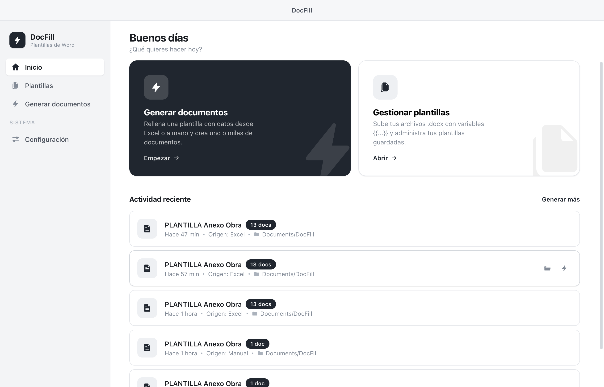
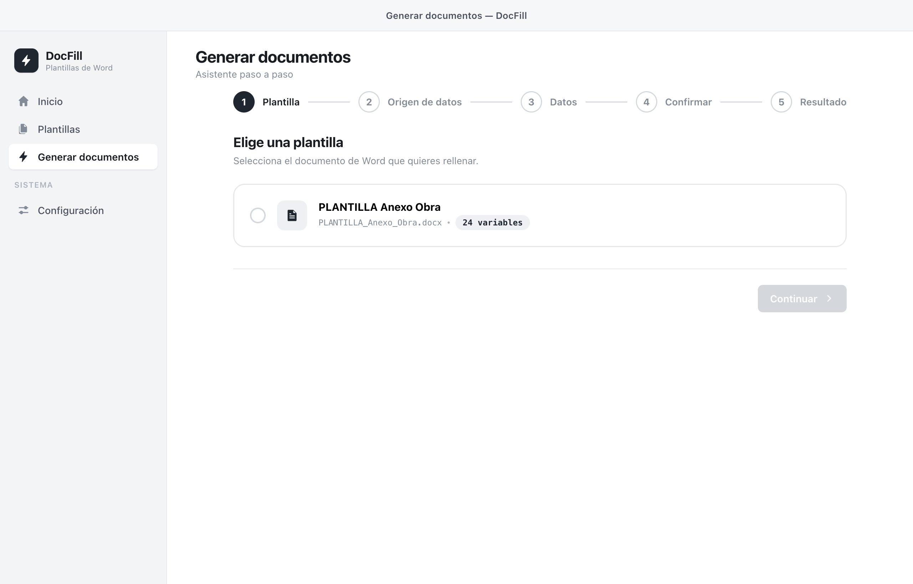
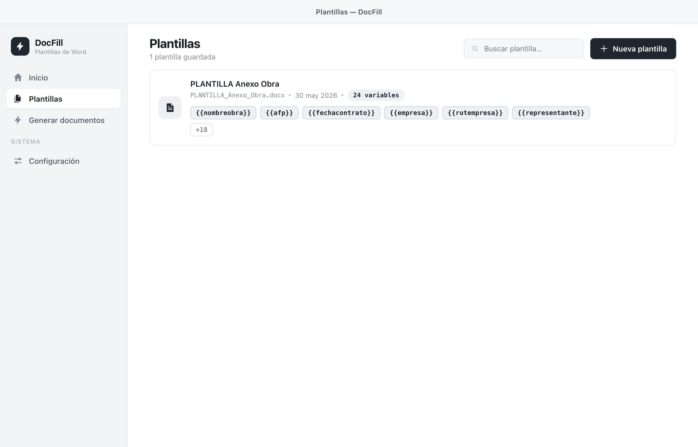
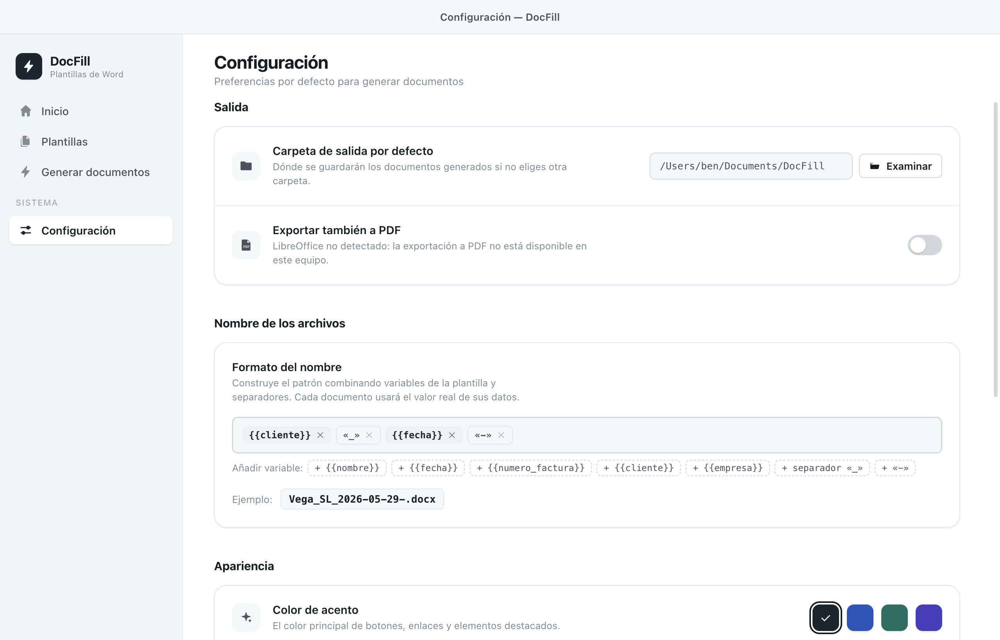

<div align="center">

[Español](README.md) · **English**

# ⚡ DocFill

**Fill Word documents automatically from your data.**

Desktop app (macOS and Windows) that generates `.docx` —and optionally `.pdf`—
documents from templates with `{{...}}` variables, using data from Excel or entered by hand.

Built with **Electron + React + Vite**. All processing is **local**: your data never leaves your machine.

</div>

---

## 📸 Screenshots

| Home | Generate (wizard) |
|:---:|:---:|
|  |  |
| **Templates** | **Settings** |
|  |  |

---

## ✨ What it does

You save Word templates that contain variables (`{{name}}`, `{{taxid}}`, `{{date}}`…) and DocFill
generates the filled documents: one per row of an Excel file, combining several Excel files, or from a
manual form.

- 📄 **Templates** — upload a `.docx`, it automatically detects the `{{…}}` variables and lets you edit
  them (readable label, type: text/date/number/amount, and default value). Live document preview.
- ⚡ **Generate (step-by-step wizard)** — template → data source → data → confirm → result.
- 📊 **From Excel (one or more files)**:
  - One document per row of the **main list**.
  - If you load several Excel files, the rest provide **shared data** (identical across all) — handy to
    combine, e.g., a list of employees with the fixed company and project details.
  - Automatic **column → variable** mapping (by name, tolerant to case/accents/spaces),
    with a **fixed-value** option per variable.
  - **Row selection**: all, a range or a list (`1-5, 8, 12-20`).
- ✍️ **Manual** — dynamic form with validation and a live preview.
- 🧩 **Fixed-value profiles** — save reusable sets (company details, etc.) and apply them in one click.
- ✅ **Pre-flight check** — flags empty fields, invalid numbers and duplicate filenames before generating.
- 🛡️ **Failure tolerance** — if a row fails, the rest carry on and you're told which ones failed.
- 🔢 **Automatic formatting** — amounts `4,200.00`, dates `dd/mm/yyyy` based on each variable's type.
- 🗂️ **Configurable filename** — pattern with variables + separators (also editable on the confirm step).
- 🧾 **PDF** — export a `.pdf` copy of each document (via headless LibreOffice).
- 📦 **When finished** — open the folder, **export everything as a `.zip`** or **merge the PDFs into one**.
- 🕘 **History** — recent activity with the option to **repeat** a generation.
- 🎨 **Appearance** — accent color, density; native window frame (macOS / Windows); **ES/EN language**.
- 🖱️ **Drag and drop** `.docx` / `.xlsx` files.

---

## 🚀 Development

**Requirements:** [Node.js 20](https://nodejs.org) and **pnpm** (via Corepack).

> Note: this project uses **pnpm 10** (pnpm 11 isn't compatible with Node 20). Activate it with:
> `corepack prepare pnpm@10.34.1 --activate`

```bash
pnpm install          # install dependencies (node-linker=hoisted, see .npmrc)
pnpm dev              # Vite + Electron together (desktop app, hot reload)
pnpm dev:web          # UI only in the browser (simulated backend, no native engine)
node scripts/smoke-engine.cjs   # document engine test (detect/fill/zip/batches)
```

To open DevTools in `dev`: `DOCFILL_DEVTOOLS=1 pnpm dev`.

---

## 📦 Packaging (installers)

```bash
pnpm build:mac            # macOS, current architecture (arm64) → release/*.dmg + *.zip
pnpm build:mac:universal  # macOS Intel + Apple Silicon (universal)
pnpm build:win            # Windows x64 → "release/DocFill Setup 0.1.0.exe"
```

Output lands in `release/`. Builds are **unsigned** (`CSC_IDENTITY_AUTO_DISCOVERY=false`),
so on other people's machines:
- **macOS**: right-click → *Open* (Gatekeeper).
- **Windows**: *More info → Run anyway* (SmartScreen).

Distribution without warnings requires signing/notarization (Apple Developer ID on Mac, a
code-signing certificate on Windows) — they're independent systems.

### PDF / LibreOffice

`.docx → .pdf` conversion uses **headless LibreOffice**. Binary lookup order
(`electron/engine/pdf.cjs`): `LIBREOFFICE_PATH` → bundled copy → system install. If none is
found, PDF export disables itself and only `.docx` files are generated.

To **bundle** LibreOffice so PDF works with no prior install:

```bash
# macOS — downloads LibreOffice and copies it to resources/libreoffice/ (~1 GB)
bash scripts/fetch-libreoffice-mac.sh

# Windows (run ON Windows) — see scripts/BUNDLING-WINDOWS.md
pnpm fetch:lo:win
```

> Bundling LibreOffice adds ~700 MB–1 GB to the installer. If `resources/libreoffice/` is empty, the
> build stays small and PDF uses the system LibreOffice.

---

## 🧱 Architecture

```
electron/
  main.cjs            main process: window, dialogs, IPC
  preload.cjs         secure bridge (contextBridge) → window.docfill
  engine/
    docx.cjs          detect variables + fill (docxtemplater) + preview (mammoth)
    xlsx.cjs          read Excel (exceljs)
    pdf.cjs           docx → pdf (headless LibreOffice)
    generate.cjs      orchestration: names, formatting, writing, progress, per-row failures
    export.cjs        zip results + merge PDFs (pdf-lib)
    store.cjs         persistent state (electron-store): templates, settings, history, profiles
src/
  App.jsx             routing, state, appearance
  api.js              unified backend access (native or simulated in the browser)
  i18n.js             ES/EN strings + translation helper
  components/         Icon, TitleBar, Sidebar, Toolbar, DocPreview, TemplatePreview, Switch, FilenameBuilder
  screens/            Home, Templates, Generate, Settings
  styles.css          design tokens + styles
resources/libreoffice bundled copy of LibreOffice (mac; not versioned)
scripts/              make-icon, fetch-libreoffice-*, smoke-engine
```

`src/api.js` unifies backend access: in Electron it uses `window.docfill` (preload); in a plain
browser (`pnpm dev:web`) it falls back to a simulated mode so you can explore the UI without the
native engine.

---

## 🛠️ Stack

- **Electron 31** · **React 18** · **Vite 5**
- **docxtemplater** + **pizzip** (fill `.docx`)
- **exceljs** (read Excel) · **mammoth** (preview) · **pdf-lib** (merge PDF)
- **electron-store** (persistence) · **electron-builder** (installers)
- **LibreOffice** headless (PDF conversion)

---

## 🔒 Privacy

Everything is processed **locally**. Templates and settings are stored in the app's data folder
for the user; nothing is sent to any server.

---

## 📋 Notes

- It's a real desktop tool; uploaded templates are copied into the app's data folder.
- macOS universal does **not** bundle LibreOffice (the bundled copy is arm64); for offline PDF on
  Apple Silicon use the `arm64` build.

---

## 📄 License

[MIT](LICENSE) © 2026 Benjamín Acosta Salinas
